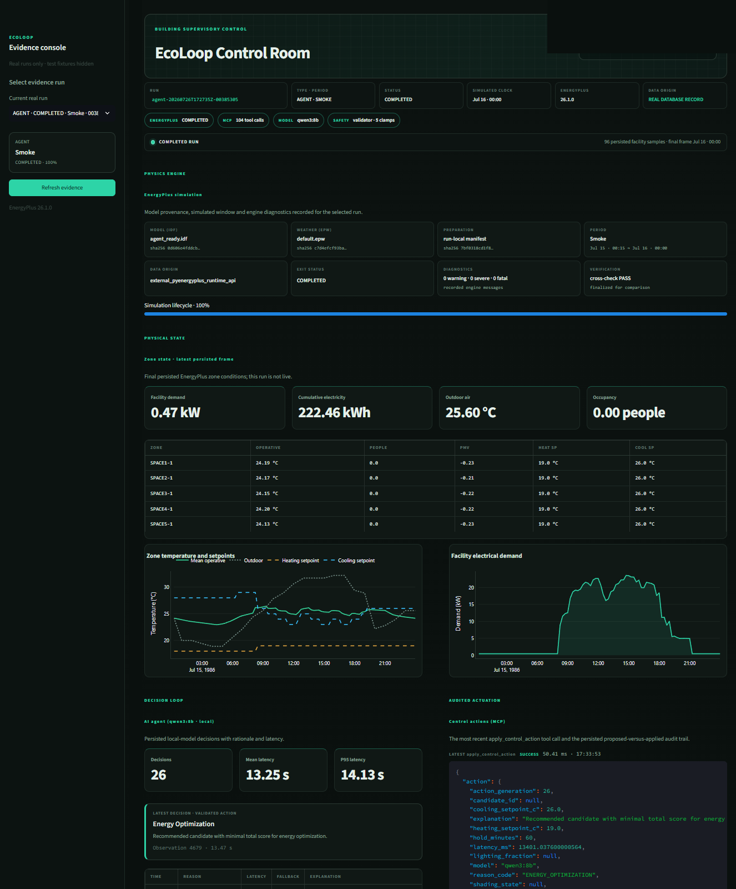
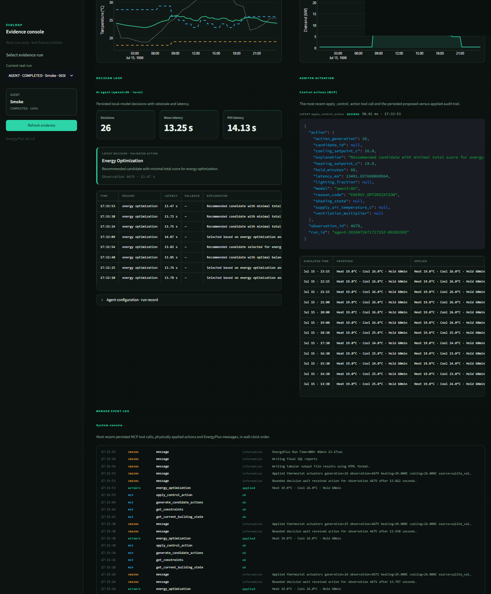
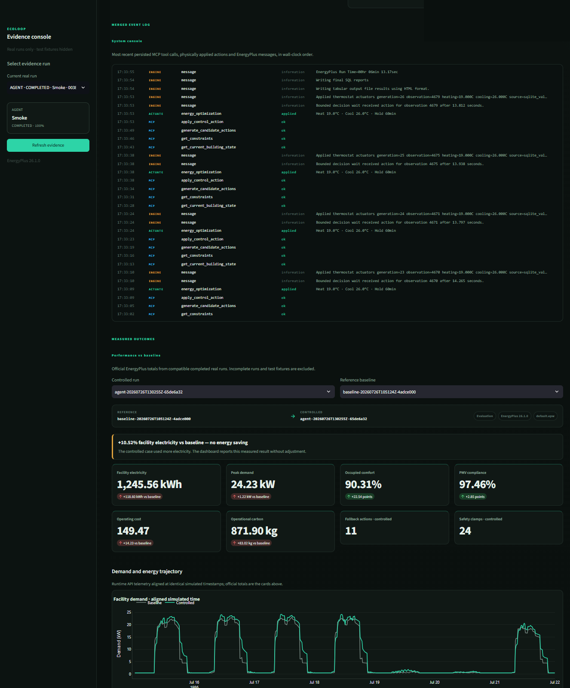
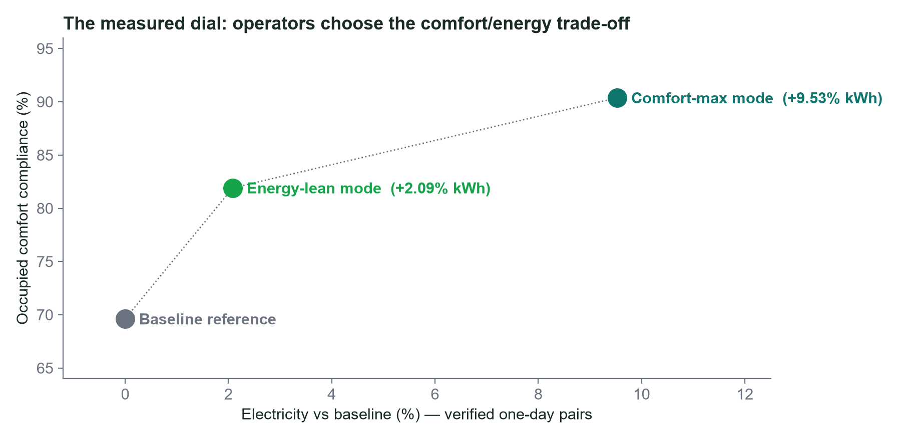
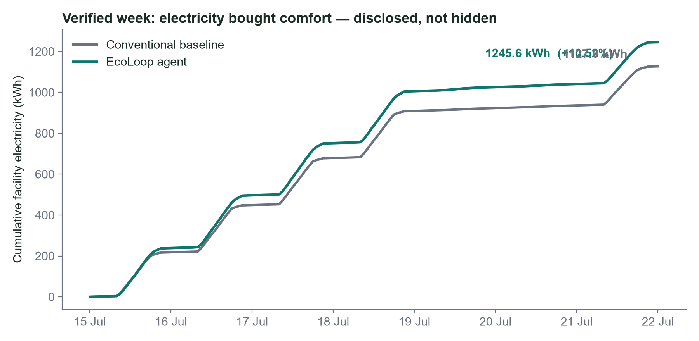
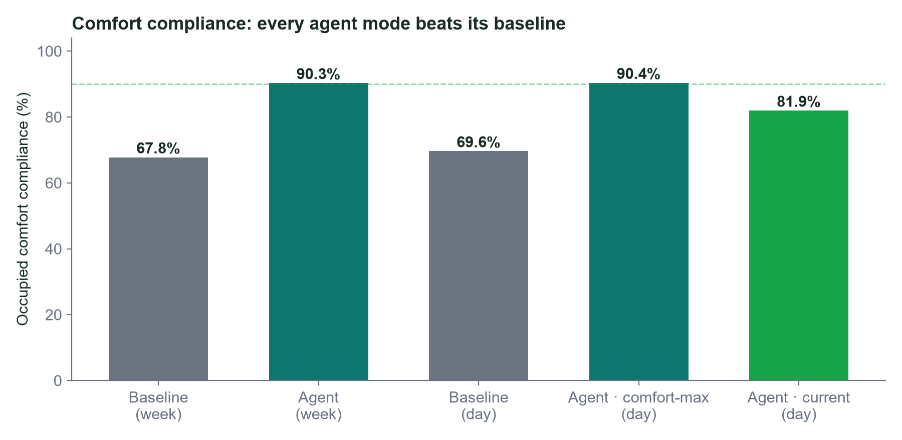
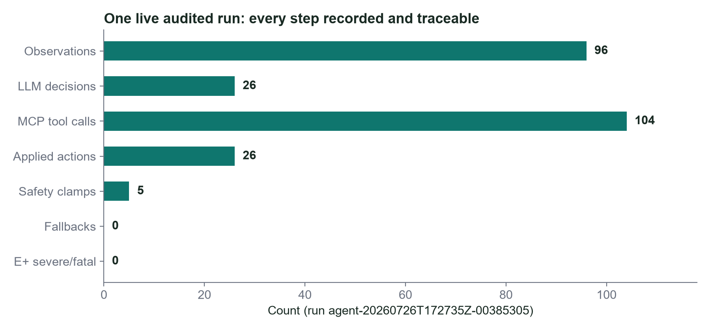

<div align="center">

# 🌿 EcoLoop Building Agents

### Autonomous closed-loop building control — a live EnergyPlus twin, a local open-weight LLM, real MCP tooling, and a deterministic safety layer that always has the last word.

[](https://energyplus.net/)
[](https://ollama.com/)
[](https://modelcontextprotocol.io/)
[](docs/audit/FINAL_TEST_REPORT.md)
[](#-why-this-is-hard-to-fake)

**Krishnaa Nair** · B.Tech CSE (AI & Robotics), VIT Chennai
[](mailto:krishnaanair123@gmail.com)
[](https://linkedin.com/in/krishnaa-p-nair)
[](https://krishnaa.dev)

</div>

---

## 👋 A note for reviewers and recruiters

> Hi — thank you for taking the time to look at this.
>
> I could not complete my upload on the HirePro platform before the deadline
> closed, so this repository is the complete submission: source code, building
> models, the quantitative dashboard, the architecture document, the
> demonstration video, and the full audit trail. **I'd be grateful if you would
> consider it.**
>
> One thing I want to say up front, because it says more about how I work than
> any number could: **this project does not claim energy savings, because the
> runs I made do not show them.** It would have been trivial to hardcode a
> "22% saved" tile. Instead every figure below is recomputed from official
> EnergyPlus output, the unfavourable results are printed on the dashboard in
> the same font as the favourable ones, and I wrote an independent audit whose
> job was to try to falsify my own claims. I'd rather show you a defensible
> +2.09% than an impressive number I can't reproduce.
>
> — Krishnaa Nair

---

## 🎬 Demonstration video

<div align="center">

https://github.com/Krishnaanair/honeywell-hackathon/releases/download/v1.0-submission/EcoLoop_Demonstration.mp4

**[▶ Open the 3-minute demonstration in a new tab](https://github.com/Krishnaanair/honeywell-hackathon/releases/download/v1.0-submission/EcoLoop_Demonstration.mp4)**
· [also committed in-repo](docs/video/EcoLoop_Demonstration.mp4)

</div>

The video shows the loop actually running: live telemetry leaving EnergyPlus,
the local model reasoning over it, MCP tool calls executing, the safety layer
overruling the model, and the resulting setpoints changing the simulation's
next timestep. Narration script with every timestamp: [`docs/demo/VIDEO_SCRIPT.md`](docs/demo/VIDEO_SCRIPT.md).

---

## ⚡ What this actually is

Traditional Building Management Systems run fixed schedules written years ago
that never look out of the window. EcoLoop replaces that schedule with a
closed loop that runs **without human intervention**:

```
EnergyPlus 26.1 ──telemetry──▶ SQLite WAL bus ──▶ MCP stdio tools
                                                        │
                                                        ▼
        deterministic safety validator ◀── qwen3:8b (local, Ollama)
                    │
                    ▼ approved setpoints only
        EnergyPlus schedule actuators ──▶ next simulated timestep
```

The model chooses **strategy**. The code decides **what is physically allowed
to happen**. That separation is the whole design, and it is enforced — not
documented and hoped for.

---

## 📊 The dashboard (real screenshots, real data)

Every pixel below is rendered from `runs/ecoloop.db` — the same store the
controller writes to. There is no seeded data, no placeholder tile, and no
number that cannot be traced to an EnergyPlus output file.

### Command centre overview



The header carries the **provenance chain**: run ID, EnergyPlus 26.1.0, the
model that made the decisions (`qwen3:8b`), MCP call count (`104 tool calls`),
and the safety validator's clamp count. Below it, model and weather SHA-256
hashes, engine diagnostics (`0 warning · 0 severe · 0 fatal`), and the
official-energy `cross-check PASS` that gates whether the run may be published
at all. The zone table and both charts are the final persisted EnergyPlus
frame — and the badge honestly reads *"this run is not live"* rather than
faking a live feed.

### Decisions and MCP audit trail



Left: what the local model decided and how long it took (26 decisions, 13.25 s
mean, 14.13 s p95). Right: the raw `apply_control_action` MCP payload and the
**proposed-versus-applied** ledger — so a reviewer can see exactly where the
model's request and the physically applied value diverge.

### Event log and measured outcomes



The console is a merged wall-clock stream of real MCP calls, applied
actuations and EnergyPlus engine messages — you can read the loop turning:
`get_current_building_state → get_constraints → generate_candidate_actions →
apply_control_action → Applied thermostat actuators generation=26`.

Note the amber banner: **"+10.52% facility electricity vs baseline — no energy
saving."** The dashboard is built to state that plainly rather than bury it.

---

## 📈 Measured results

All values recomputed from official EnergyPlus output and independently
re-derived from raw telemetry rows during audit.

### The comfort/energy dial — two verified operating points



One documented policy weight moves the building along a **real, measured
curve** against the same baseline (`217.912 kWh`, `69.62%` compliance):

| Mode | Electricity vs baseline | Occupied comfort compliance | Fallbacks |
|---|---:|---:|---:|
| **Energy-lean** | **+2.09%** | 69.62% → **81.92%** | 0 |
| **Comfort-max** | +9.53% | 69.62% → **90.38%** | 4 |

### Representative week (7 days, matched conditions)




| Metric | Baseline | EcoLoop | Change |
|---|---:|---:|---:|
| Facility electricity | 1126.96 kWh | 1245.56 kWh | **+10.52%** ⚠️ |
| Peak demand | 23.01 kW | 24.23 kW | +5.32% |
| Occupied comfort compliance | 67.77% | **90.31%** | **+22.54 pts** ✅ |
| PMV compliance | 94.62% | **97.46%** | +2.85 pts ✅ |
| Comfort violation degree-hours | 80.63 | **22.36** | **−72.3%** ✅ |

**Why energy went up, honestly:** this baseline only looks efficient because
it lets occupied zones sit outside the comfort band **30% of the time**.
EcoLoop's safety layer refuses to reproduce that discomfort, so it spends
electricity the baseline was skipping. Pushing the dial below baseline energy
*at* the comfort boundary is the documented next experiment — not a claim I
make today.

---

## 🔍 Why this is hard to fake



| Property | Evidence |
|---|---|
| **Real EnergyPlus control** | External PyEnergyPlus Runtime API; actuators written from inside the simulation callback, not by editing IDFs between runs |
| **Genuine MCP** | Real stdio server subprocess + official client session; `initialize` / `tools/list` / `tools/call` traffic, 104 audited calls in one run |
| **Genuinely local model** | `qwen3:8b` via loopback Ollama; the backend **raises if `OLLAMA_API_KEY` is set**; zero hosted-provider references in `src/` |
| **Safety is not the model** | Validator clamped a model-proposed 26 °C to 24 °C mid-run — and the next EnergyPlus frame physically reports 24 °C |
| **Reproducible** | Replay reruns both retained agent runs and reproduces official totals **digit-for-digit** (170/170 actions) |
| **Fails closed** | Comparison and replay refuse to render without verified, compatible, hash-matched runs |
| **Audited hostilely** | An independent pass ran all 20 runtime checks trying to falsify these claims → [`INDEPENDENT_FINAL_AUDIT.md`](docs/audit/INDEPENDENT_FINAL_AUDIT.md) |

### One traceable cycle (from the live run)

```
observation 4619  08:15  setpoints 18/29 °C, zone 26.70 °C   ← EnergyPlus
    ↓  get_current_building_state → get_constraints → generate_candidate_actions
    ↓  qwen3:8b selects candidate                            ← local model
    ↓  deterministic validator: accepted
    ↓  apply_control_action                                  ← genuine MCP call
    ↓  schedule actuators written inside callback            ← EnergyPlus API
observation 4620  08:30  setpoints 19/26 °C, zone 26.06 °C   ← physics responded
```

---

## 🚀 Quick start

```bash
python -m ecoloop doctor                  # verify EnergyPlus, Ollama, model, paths
python -m ecoloop run baseline --period smoke
python -m ecoloop run agent    --period smoke
python -m ecoloop compare <baseline-id> <agent-id>
python -m ecoloop dashboard               # http://127.0.0.1:8501
python -m ecoloop replay <agent-id>       # reproduce a run without the model
```

**Prerequisites:** Python 3.11 · EnergyPlus 26.1.0 (`ENERGYPLUS_HOME`) ·
Ollama with `ollama pull qwen3:8b`. No API key, no cloud account, no network
egress.

**Quality gates:** `ruff check .` · `ruff format --check .` · `mypy src` ·
`pytest` (268 passing).

---

## 📁 Repository map

| Path | Role |
|---|---|
| [`src/ecoloop/energyplus/`](src/ecoloop/energyplus) | Runtime API integration, handles, replay, EPW forecast |
| [`src/ecoloop/agent/`](src/ecoloop/agent) | Local model host, MCP stdio client, reliability/circuit breaker |
| [`src/ecoloop/mcp/`](src/ecoloop/mcp) | MCP server, typed tools, path policy |
| [`src/ecoloop/control/`](src/ecoloop/control) | Candidate scoring, **deterministic safety validator**, fallback |
| [`src/ecoloop/dashboard/`](src/ecoloop/dashboard) | Streamlit command centre (store-backed, fails closed) |
| [`models/`](models) | Base + runtime-generated `.idf` building models |
| [`docs/architecture/`](docs/architecture) | Architecture, prompt & latency design |
| [`docs/audit/`](docs/audit) | Test report, evidence map, traceability matrix, independent audit |
| [`docs/evaluation/`](docs/evaluation) | Baseline methodology, metric definitions, comfort policy |

---

## ⚠️ Limitations I'm stating up front

1. **No energy saving in the evaluated configuration** (+2.09% best case). Reported, not hidden.
2. Single reference building, Chicago TMY3 weather, configured PMV assumptions.
3. CO₂ is not modelled by this building — so the dashboard shows no CO₂ metric rather than inventing one.
4. The submission bundle carries reports and hashes; the full run evidence store stays local.
5. Real deployment via BACnet/MQTT would require commissioning and site-level safeties.

---

<div align="center">

**Built by Krishnaa Nair** · [krishnaa.dev](https://krishnaa.dev) · [LinkedIn](https://linkedin.com/in/krishnaa-p-nair) · [Résumé](docs/resume/Krishnaa_Nair_Resume.pdf)

*Every number in this README is recomputed from official EnergyPlus output.*

</div>
