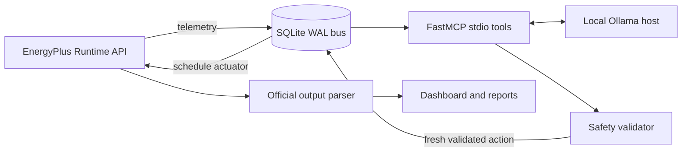

# EcoLoop Building Agents

**A guardrailed, open-source local-LLM supervisory controller for EnergyPlus
buildings.**

EcoLoop connects EnergyPlus 26.1.0 telemetry to a durable SQLite bus, exposes
narrow building-control tools through the official Model Context Protocol SDK,
uses a local Ollama model to select evaluated setpoint candidates, validates
every decision through an independent deterministic safety layer, and applies
supported thermostat schedule actuators through PyEnergyPlus.

<!-- BEGIN VERIFIED_EVALUATION_STATUS -->
> Evidence status: the real actuator proof and one-day closed-loop acceptance
> test are verified. The representative-week baseline is verified, while its
> paired agent run is still being evaluated. No representative-week comparison
> or savings claim is published yet.
<!-- END VERIFIED_EVALUATION_STATUS -->

Canonical run identities, measured values, and publication status live in
[`docs/results.md`](docs/results.md). Implementation and test history live in
[`docs/progress.md`](docs/progress.md).

## Why this matters

Conventional schedules cannot respond to fast changes in occupancy, weather,
comfort, tariff, carbon intensity, or demand. Directly placing a language model
in a control loop is unsafe and difficult to audit. EcoLoop separates flexible
candidate selection from deterministic constraints, bounded capabilities,
durable evidence, and automatic fallback control.

## Architecture



[Rendered SVG architecture](docs/diagrams/system-architecture.svg) ·
[Rendered PNG architecture](docs/diagrams/system-architecture.png)

The complete callback, protocol, safety, replay, and security design is in
[`docs/architecture.md`](docs/architecture.md).

## Evidence at a glance

- **Actuator proof:** a real EnergyPlus acceptance run changed active thermostat
  schedule actuators and recorded a later physical response. It is not presented
  as an agent-energy comparison.
- **Closed-loop proof:** a real one-day run exercised EnergyPlus, SQLite, MCP
  stdio, local inference, deterministic validation, actuation, and subsequent
  telemetry. Its measured comfort/energy trade-off is reported without turning
  it into a savings claim.
- **Headline evaluation:** the configured representative week is published only
  after both matched real runs complete and official totals pass telemetry and
  provenance checks.

## Quick start

Prerequisites:

- Python 3.11
- EnergyPlus 26.1.0 installed separately
- Ollama with `qwen3:8b` (or another tool-capable local model)
- A licensed EPW weather file

### Windows dependency setup

Install Python, `uv`, and Ollama:

```powershell
winget install --id Python.Python.3.11 --exact
winget install --id astral-sh.uv --exact
winget install --id Ollama.Ollama --exact
```

Download the official EnergyPlus 26.1.0 Windows archive and verify the pinned
digest before extraction:

```powershell
$archive = "$env:TEMP\EnergyPlus-26.1.0-Windows-x86_64.zip"
Invoke-WebRequest `
  "https://github.com/NatLabRockies/EnergyPlus/releases/download/v26.1.0/EnergyPlus-26.1.0-6f2e40d102-Windows-x86_64.zip" `
  -OutFile $archive
(Get-FileHash $archive -Algorithm SHA256).Hash.ToLower()
# Expected:
# 0bb6932d277eed62f996b625f37c533b8c35f9af0c53710d961d8442fc4e70b3
Expand-Archive $archive -DestinationPath $env:USERPROFILE
$env:ENERGYPLUS_HOME = `
  "$env:USERPROFILE\EnergyPlus-26.1.0-6f2e40d102-Windows-x86_64"
```

Install the checksummed default Chicago TMY3 weather file from that distribution
(or set `ECOLOOP_WEATHER_PATH` to another verified EPW):

```powershell
py -3.11 scripts/install_weather.py --energyplus-home "$env:ENERGYPLUS_HOME"
```

The installer can also retrieve the exact pinned release archive itself:

```powershell
py -3.11 scripts/install_weather.py --download
```

Start Ollama and install the default local model:

```powershell
ollama serve
ollama pull qwen3:8b
```

EnergyPlus is installed separately on Linux and macOS from the matching
26.1.0 asset on the official
[EnergyPlus release page](https://github.com/NatLabRockies/EnergyPlus/releases/tag/v26.1.0).
Verify the platform asset against the checksum published with that release, set
`ENERGYPLUS_HOME` to the extracted installation, and run the same weather
installer.

### Project setup

```powershell
py -3.11 -m pip install uv
uv sync --extra dev --locked
Copy-Item .env.example .env
uv run python -m ecoloop doctor
uv run python -m ecoloop prepare-model
uv run python -m ecoloop demo
```

Pip-compatible installation:

```powershell
py -3.11 -m venv .venv
.\.venv\Scripts\Activate.ps1
python -m pip install -e ".[dev]"
python -m ecoloop doctor
```

Linux/macOS pip-compatible setup:

```bash
python3.11 -m venv .venv
source .venv/bin/activate
python -m pip install -e '.[dev]'
cp .env.example .env
python -m ecoloop doctor
```

The doctor command validates the EnergyPlus build, local model, weather, model,
and writable artifact paths before any real demo starts.

`python -m ecoloop demo` never enables fake mode. It runs the preflight checks,
reuses or creates a verified demo-period baseline, starts the dashboard, launches
the real controlled process, prints both run IDs and the local URL, and writes
the controlled ID to `runs/current_run.txt`. The dashboard remains available
after a clean run until Ctrl+C, which shuts down its child processes.

For a recording-friendly pace without changing simulated time or calculated
energy:

```powershell
uv run python -m ecoloop demo --display-delay-seconds 0.15
```

## Commands

```text
python -m ecoloop doctor
python -m ecoloop prepare-model
python -m ecoloop run baseline --period smoke
python -m ecoloop run rule --period smoke
python -m ecoloop run agent --period smoke
python -m ecoloop compare BASELINE_RUN_ID AGENT_RUN_ID
python -m ecoloop dashboard
python -m ecoloop demo
python -m ecoloop replay RUN_ID
python -m ecoloop export RUN_ID
python -m ecoloop package-submission
```

## Inspect the MCP server

The production server uses stdio and exposes only the bounded EcoLoop tools. Run
the official [MCP Inspector](https://github.com/modelcontextprotocol/inspector)
from the repository root:

```powershell
npx @modelcontextprotocol/inspector -- .\.venv\Scripts\python.exe -m ecoloop.mcp.server
```

On Linux or macOS:

```bash
npx @modelcontextprotocol/inspector -- .venv/bin/python -m ecoloop.mcp.server
```

Open the local URL printed by Inspector, choose stdio, list the tools, and call a
read-only tool such as `get_last_energyplus_errors` with an existing run ID.
Control-affecting calls are validated and written to the SQLite audit bus.

## Real-data policy

Default commands never fabricate telemetry, energy, comfort, or savings.
Synthetic operation is available only with an explicit `--fake` flag for tests
and CI and is labelled accordingly. A failed or incomplete EnergyPlus run cannot
produce a savings claim.

## Repository layout

```text
src/ecoloop/        controller, MCP, EnergyPlus, storage, CLI, dashboard
tests/              unit, protocol integration, and dependency-aware real tests
models/base/        version-matched source model and provenance
models/generated/   repeatable baseline, controlled, and replay models
config/             version-controlled defaults
docs/               architecture, methodology, operations, and results
presentation/       supplied template and completed deck
runs/               local SQLite bus and EnergyPlus run artifacts
submission/         reproducible submission package
```

## Screenshots

The repository keeps filenames stable so submission screenshots can be replaced
without changing documentation links:

- `docs/images/live-operations.png`: capture **Live Operations** with the selected
  evidence run ID, period, status, simulation clock, active setpoints, and latest
  proposed/applied action visible.
- `docs/images/baseline-vs-agent.png`: capture **Baseline vs Agent** only after
  the dashboard displays `Compatible completed real runs.` for the selected
  evaluation pair. Keep both run selectors and the compatibility banner visible.
- `docs/images/decision-trace.png`: capture **Agent Decisions** with the selected
  action, proposed-versus-applied values, safety outcome, reason code, latency,
  and MCP trace visible.
- `docs/images/reliability.png`: capture **Reliability and Errors** with timeout,
  fallback, clamp, and EnergyPlus severity counts visible.

Do not crop out the run identity or a `REAL RUN REPLAY` banner. If the matched
week is incomplete, show the dashboard's honest incomplete status instead of
substituting fake data or an unrelated period.

## Evaluation

The baseline is a credible fixed occupied schedule with unoccupied setback.
Baseline and controlled cases must use identical model, weather, dates, timestep,
and internal loads. Official energy totals are parsed from EnergyPlus output CSV
or SQLite and cross-checked against runtime telemetry. Comfort, reliability,
latency, cost, carbon, and independent fuel metrics are reported with the same
period status gates. See [`docs/methodology.md`](docs/methodology.md).

## Limitations

EnergyPlus and weather are external assets; real integrations cannot be validated
without them. Optional actuators are disabled until discovered. The candidate
scorer is transparent bounded heuristic/predictive scoring, not a full
model-predictive controller. See [`docs/limitations.md`](docs/limitations.md).

## Licence

EcoLoop source code is MIT licensed. EnergyPlus, example models, weather data,
Ollama, and local model weights retain their own licences. See
[`THIRD_PARTY_NOTICES.md`](THIRD_PARTY_NOTICES.md).
