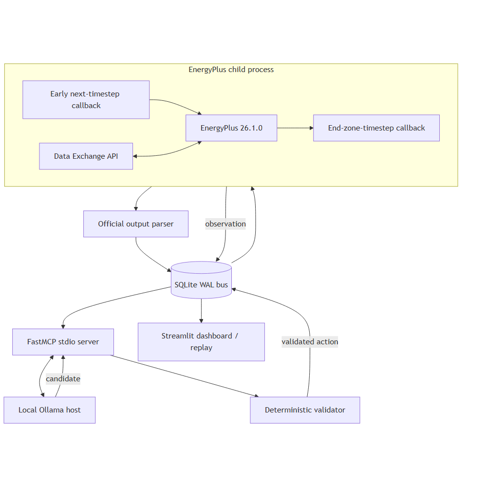
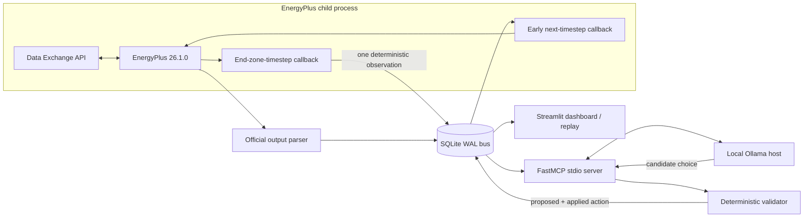
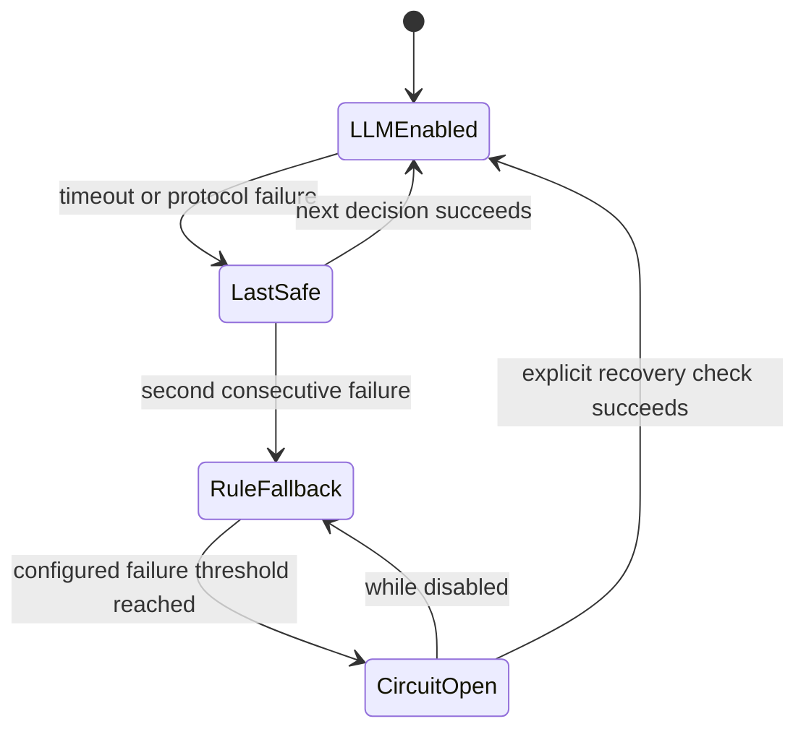

# Architecture

## System boundary

EcoLoop is a supervisory layer, not an HVAC equipment controller. EnergyPlus
26.1.0 remains the physical simulation and low-level control engine. EcoLoop
observes zone-timestep state, chooses bounded thermostat schedule setpoints,
validates them independently, and writes only verified actuator capabilities.

The Mermaid source is also stored at
[`docs/diagrams/system-architecture.mmd`](diagrams/system-architecture.mmd).

## EnergyPlus callback lifecycle

Each simulation runs in its own operating-system process and creates one fresh
`EnergyPlusAPI` state. Baseline and controlled cases never reuse callbacks or
state.

1. Before execution, required output variables are registered with
   `request_variable`.
2. The message callback stores EnergyPlus stdout messages, severity, and a
   duplicate hash.
3. The progress callback stores the reported percentage on the run.
4. Handle discovery waits until
   `api.exchange.api_data_fully_ready(state)` returns true.
5. The registry resolves every required variable, meter, schedule actuator, and
   optional capability exactly once.
6. At the end of each zone timestep, telemetry is sampled once using a
   deterministic key: run, environment, calendar date, hour, minute, and zone
   timestep.
7. Warmup and sizing/design-day data are retained only when diagnostically useful
   and excluded from evaluation metrics by default.
8. An early callback in the following timestep reads the newest applicable
   action. Wrong-run, stale, expired, regressed-generation, or already-applied
   actions are ignored.
9. Supported schedule actuators receive the validated heating and cooling
   values. Unsupported optional fields are never sent.
10. Exit code, fatal status, logs, output artifacts, and state disposal are
    recorded even on failure.

The actuator never calculates an offset from an already-overridden value. Model
preparation creates a separate unmodified reference schedule for comparison.

## Handle discovery and diagnostics

`HandleRegistry` records the logical metric, EnergyPlus point type, name, key,
handle, units, and required/optional status. A negative handle for a required
point is a hard integration error; it is never converted to zero.

On a missing point the runtime:

1. writes `api_points.csv` from `list_available_api_data_csv`;
2. normalizes case, punctuation, whitespace, and separators;
3. ranks close candidates;
4. includes the requested name/key and suggestions in the failure;
5. disables only an explicitly optional capability.

The same capability map gates runtime actions, MCP responses, validation, replay,
and dashboard fields.

## SQLite communication bus

SQLite runs in WAL mode with foreign keys and a busy timeout. Versioned,
append-only migrations create:

- `runs`
- `telemetry`
- `zone_telemetry`
- `observations`
- `proposed_actions`
- `applied_actions`
- `agent_decisions`
- `tool_calls`
- `simulation_messages`
- `errors`
- `metrics`
- `run_artifacts`

Every operational row includes `run_id` and a timestamp. Observations receive a
monotonically increasing ID. Unique indexes prevent duplicate timestep
telemetry, action generations, and repeated action application. Transactions are
short so EnergyPlus and the model host remain decoupled.

The simulation never waits indefinitely for model inference. It polls durable
state and applies only a fresh action at an allowed callback boundary.

## MCP client/server boundary

The MCP server is launched over stdio. It exposes only the fifteen requested
building-control and diagnostic tools. Tool arguments are typed and validated by
Pydantic. File arguments are resolved against the repository and configured
EnergyPlus roots.

The server does not expose shell execution, package installation, arbitrary
network access, deletion, or general file access. Control-affecting tool calls
are written to `tool_calls` before their result is considered complete.

The host uses the official MCP client to:

1. start/connect to the stdio server;
2. negotiate and list tools dynamically;
3. convert JSON Schemas to Ollama tool definitions;
4. call requested tools through the MCP session;
5. return tool results to the local model;
6. stop only after a validated apply or safe fallback succeeds.

Direct Python calls are used only inside a tool implementation after the MCP
protocol request has reached the server. They are not a substitute for the
client/server boundary.

## Local model tool loop

The system prompt defines the supervisory role, prohibits unsupported actions,
requires a short reason code/explanation, and mandates this evidence sequence:

- `get_current_building_state`
- `get_constraints`
- `generate_candidate_actions` or `evaluate_candidate_actions`
- `apply_control_action` or `request_safe_fallback`

If a sequence is incomplete, the attempt is rejected and one concise corrective
message is issued. A second failure produces deterministic fallback. The host
uses temperature zero or the closest supported setting, bounded tool rounds,
one retry, keep-alive, a request timeout, and complete tool-call auditing.

The audit stores inputs, outputs, duration, result status, model, and short
operational explanation. It does not request or record private hidden reasoning.

## Safety validation

The model proposes; the validator decides what can be applied. Validation
enforces:

- finite numeric values;
- run and observation identity/freshness;
- expiry and maximum hold duration;
- monotonic generation and idempotency;
- occupied/unoccupied setpoint ranges;
- minimum deadband;
- maximum normal step change;
- actuator capability;
- freeze and overheat protection;
- demand emergency limits;
- heating setpoint strictly below cooling setpoint.

Both values are stored when clamping occurs. A validation result includes each
rule outcome and clamp details.

## Failure recovery

The default failure sequence is deterministic:

The last-known-safe action is held for at most one normal interval. The rule
fallback then follows occupancy, comfort margin, demand, and safety bounds.
Repeated failures open the circuit breaker. A fatal EnergyPlus message ends the
run, preserves logs, and suppresses comparison metrics.

## Log and prompt latency management

Raw simulation logs never enter the model context. The runtime classifies and
deduplicates messages, hashes duplicates, keeps bounded severe/fatal excerpts,
and stores the complete log separately.

The model receives compact JSON consisting of current aggregated state,
quantized recent trends, constraints, candidates, forecast/grid summaries,
baseline reference, actuator capabilities, and the previous action. A
configurable approximate token budget truncates low-priority history before
current safety state.

Nearly identical quantized observations can reuse a still-valid cached action
only after the same deterministic validator runs again.

## Result and replay architecture

Final energy totals come from EnergyPlus output CSV or SQLite. Runtime meter
telemetry is a cross-check, not the sole official accumulator. Result parsing
records electricity, HVAC electricity, every other fuel, peak demand, comfort,
IAQ, reliability, latency, warning/severe/fatal counts, cost, and carbon.

After a controlled run, exported actions create `action_schedule.csv` and a
schedule-driven replay model. Replay runs EnergyPlus without Ollama, reproducing
the applied setpoint sequence. Dashboard replay is explicitly labelled and
changes only wall-clock display speed, never simulated timestamps or metrics.

## Security boundaries

- Local model inference only.
- Stdio MCP transport only for the runtime host.
- Repository/EnergyPlus allow-list for diagnostic paths.
- Logs, IDF text, and file content are untrusted data, never instructions.
- No model-supplied command execution or package installation.
- No secrets or API keys.
- Capability discovery precedes optional actuation.
- Every control-affecting request and validation result is durable.
- Failed/incomplete/mismatched runs cannot publish savings.
