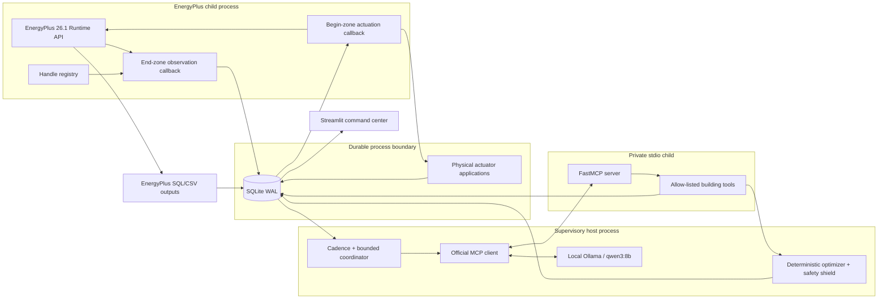
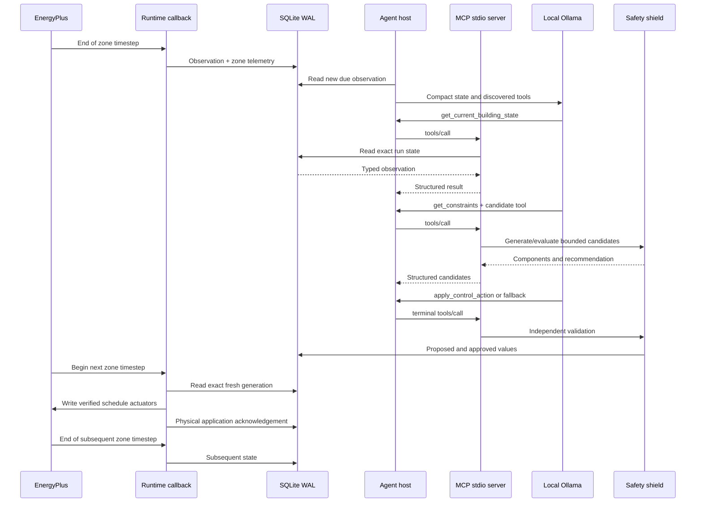
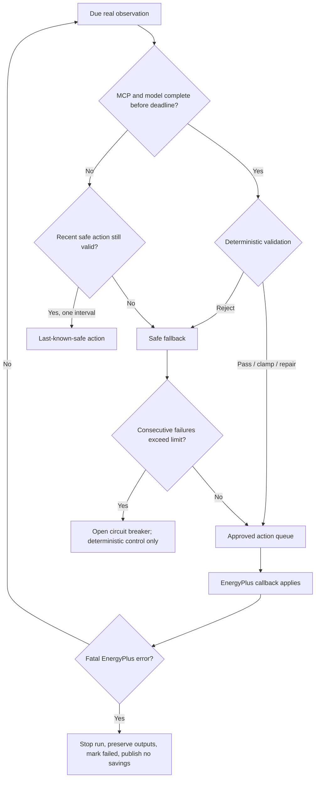

# EcoLoop Runtime Architecture

This document is the acceptance-oriented architecture view. The longer module
inventory and configuration notes remain in
[`../architecture.md`](../architecture.md).

## Component boundary

The EnergyPlus state never crosses the child-process boundary. The supervisory
worker and MCP tools exchange only typed, persisted state. Ollama cannot access
the EnergyPlus API, shell, package manager, or unrestricted filesystem.

## Closed-loop sequence

## Fast and supervisory loops

The EnergyPlus child owns the fast loop. It reads sensors, records one
deterministic timestep identity, applies only the latest exact-observation
approved action, and performs immediate runtime freshness/generation checks.

The host owns the slower supervisory loop. The default decision interval is 60
simulated minutes, with configured comfort, occupancy, demand, outdoor-change,
and expiry triggers. Model inference runs outside the EnergyPlus process. The
current accelerated demonstration uses a bounded exact-observation handshake so
EnergyPlus does not outrun a local model; it never waits indefinitely. A future
real-time building adapter would use the same durable queue without pausing a
field controller.

## Control authority

The local model has a meaningful but limited role:

- choose whether to use the evaluated candidate path or safe fallback;
- inspect current state and constraints through MCP;
- select one of the bounded candidates;
- provide a concise reason code and operational explanation.

Deterministic code alone decides permissible numeric ranges, occupied and
unoccupied comfort bounds, thermostat deadband, ramp rate, hold duration,
capabilities, emergency recovery, freshness, expiry, monotonic generation, and
final authorization.

## Process and thread boundaries

| Boundary | Owner | Data crossing it |
| --- | --- | --- |
| EnergyPlus process | Fresh PyEnergyPlus state per run | SQLite rows and output files only |
| Runtime callback thread | EnergyPlus | Typed sensor values and approved action records |
| Coordinator event loop | Parent Python process | Observation IDs, compact state, decision results |
| MCP stdio child | FastMCP server | JSON-RPC initialization, tools/list and tools/call |
| Ollama HTTP endpoint | Local/self-hosted runtime | Compact state, tool schemas/results, concise decision |
| Dashboard process | Streamlit | Read-only SQLite queries and bounded evidence downloads |

Baseline and controlled runs always receive separate EnergyPlus processes and
states. No callback or API state is reused.

## Failure paths

Malformed model output, unknown tools, skipped mandatory tools, MCP transport
failure, timeout, stale actions, unavailable actuators, and repeated rejection
all converge on deterministic fallback. A fatal EnergyPlus run is never
described as recovered; a configured restart is a new run ID.

## Live, replay and test data paths

- **LIVE SIMULATION:** a running real EnergyPlus row is receiving new callback
  telemetry. Dashboard freshness is based on persisted wall time.
- **VERIFIED RUN REPLAY:** a completed real controlled run with verified final
  metrics and passing official-energy cross-check is rendered at a controlled
  visual clock. No model is called during display replay.
- **DEMO DATA:** explicit `--fake` fixtures used only by tests/CI. Production
  dashboard queries exclude these rows.
- **DISCONNECTED:** no valid database/run or stale backend; no KPI is inferred.

Runtime action replay uses the source run's immutable model, actuator map,
weather checksum, and physical application timestamps. It is distinct from
dashboard visual replay.

## Baseline comparison path

The baseline is a conventional fixed occupied/unoccupied schedule. A controlled
run may attach only to a completed baseline with matching EnergyPlus version,
period snapshot, model-preparation fingerprint, weather file checksum, and
verified official metrics. Publication also requires identical finalized
simulation start/end and passing telemetry-to-official energy cross-checks.

Energy, peak, cost, carbon, and comfort formulas exist only in the backend
metrics/evaluation layer. The dashboard consumes the resulting canonical
metrics; it does not implement alternative KPI formulas.

## Security boundary

The MCP server exposes only typed building operations and repository/installed
EnergyPlus diagnostic paths. It exposes no shell, package installation, network
browser, deletion, or arbitrary read/write tools. IDF content and EnergyPlus log
text are treated as untrusted data and bounded before model context. No secret
or cloud API credential is required.
