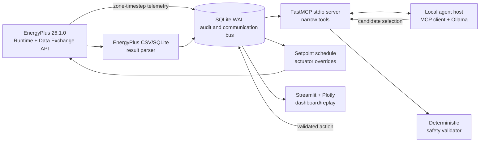

# EcoLoop Building Agents - Implementation Plan

Last updated: 2026-07-26

## Assumptions

- This workspace started empty and is being initialized as the EcoLoop repository.
- The supported runtime is Python 3.11 even if a developer machine also has newer
  interpreters installed.
- EnergyPlus 26.1.0 is an external system dependency. It is discovered at runtime
  and is never represented as a PyPI dependency.
- Ollama is the only production inference backend. `OLLAMA_MODEL` defaults to
  `qwen3:8b`; no hosted inference provider or cloud API key is required.
- A real run means telemetry and totals produced by EnergyPlus. Fake mode is
  opt-in via `--fake` and exists only for tests, CI, and pipeline development.
- A version-matched EnergyPlus example model is copied only after EnergyPlus
  26.1.0 is available and its examples and schema can be inspected. Until then,
  model preparation and real simulation tests are reported as blocked.
- Weather data is configured externally unless a verified, redistributable EPW
  with a published checksum is identified. The repository does not ship weather
  data with unclear licensing.
- SQLite is sufficient for the single-building hackathon runtime and makes the
  communication bus reproducible and inspectable without another service.
- The baseline and controlled cases use the same building, weather, run period,
  timestep, internal loads, and simulation options.
- Electricity and every other fuel are reported independently. Electricity
  savings are never relabelled as whole-building energy savings.

## Architecture

The simulation process owns EnergyPlus state. Baseline and controlled simulations
run in separate child processes. At the end of each zone timestep, the observation
callback writes one deterministic observation and zone telemetry batch. An
actuation callback early in the following timestep reads only a fresh, matching,
monotonically generated action and applies supported schedule actuators.

The local agent host communicates with the FastMCP server over stdio using the
official MCP Python client. The host discovers tool schemas dynamically, converts
them to Ollama tool definitions, enforces the mandatory tool sequence, records
tool traces without hidden reasoning, and terminates at a validated apply or
fallback result. SQLite WAL decouples the simulation from model latency.

The deterministic safety layer is independent of the model. It validates
freshness, capabilities, finite values, occupied/unoccupied bounds, deadband,
ramp rate, expiry, generation monotonicity, freeze/overheat conditions, and
demand emergencies. A timeout policy uses the last-known-safe action for one
interval, then a rule fallback; repeated failures open a circuit breaker.

Official run metrics come from EnergyPlus output CSV or SQLite files and are
cross-checked against telemetry accumulations. Dashboard and reports query the
same run database and refuse to calculate savings for incomplete or failed runs.

## Dependency choices

| Area | Choice | Reason |
| --- | --- | --- |
| Packaging | `pyproject.toml` + `uv.lock` | Reproducible Python 3.11 environment with pip-compatible metadata |
| Configuration | `pydantic-settings` + Pydantic v2 | Typed environment and file configuration |
| Database | standard-library `sqlite3` | Explicit SQL, low overhead, WAL support, no ORM state |
| CLI | Typer | Typed, discoverable command suite |
| MCP | official `mcp` SDK and `FastMCP` | Genuine stdio client/server protocol and schema discovery |
| LLM | official Ollama Python client / HTTP API | Local-only inference and native tool calling |
| Dashboard | Streamlit, Plotly, pandas | Fast live/replay UI over actual run data |
| EnergyPlus | external PyEnergyPlus Runtime API 26.1.0 | Direct callbacks and actuator access |
| Model patching | EnergyPlus 26.1 epJSON/schema conversion | Avoids guessing IDF fields or broad regex editing |
| Reports | ReportLab with visual PDF verification | Deterministic PDF generation without office software |
| Presentation | Theme-preserving PPTX pipeline | Template-aware generation and render validation |
| Quality | pytest, pytest-asyncio, Ruff, mypy | Deterministic unit/integration tests and CI gates |

Exact Python package versions are locked only after resolving them with Python
3.11. The project metadata remains pip installable.

## Implementation phases

1. **Repository foundation**
   - Initialize Git metadata, Python project metadata, configuration, logging,
     CLI shell, Makefile, environment example, licences, and CI.
   - Add typed domain schemas and shared time/serialization utilities.
2. **Durable bus and deterministic control**
   - Implement versioned SQLite migrations, repositories, idempotency rules,
     observation IDs, artifact tracking, and dashboard queries.
   - Implement constraints, safety validation, candidate generation/scoring,
     fallback control, cadence triggers, action caching, and metrics formulas.
3. **EnergyPlus discovery and model preparation**
   - Implement cross-platform discovery and `doctor`.
   - Inspect the EnergyPlus 26.1 example inventory and schema, select a model,
     record provenance/licence, and build repeatable baseline/agent/replay model
     preparation through epJSON.
4. **EnergyPlus runtime**
   - Implement fresh-state process workers, callbacks, variable requests, handle
     registry, point dump/near-match diagnostics, duplicate timestep protection,
     action polling, actuator application, messages/progress, disposal, and
     official result parsing.
5. **MCP and local agent**
   - Implement narrowly scoped runtime/diagnostic FastMCP tools and path policy.
   - Implement a real stdio MCP client, dynamic Ollama tool conversion,
     mandatory tool-loop enforcement, timeout/retry/circuit-breaker behavior,
     compact context, and complete trace auditing.
6. **User experience and reproducibility**
   - Implement dashboard tabs, clearly labelled real replay, demo orchestration,
     exports, comparison, replay schedule/model generation, and submission
     packaging.
7. **Verification**
   - Run Ruff, mypy, unit tests, fake integration tests, dashboard/report tests,
     and dependency-aware real smoke tests.
   - Record absent external dependencies as blocked with actionable fixes; never
     reinterpret skipped tests as passes.
8. **Documentation and submission**
   - Complete architecture, methodology, controls, prompting, limitations,
     troubleshooting, results, reproducibility, demo script, presentation,
     verified PDFs, source ZIP, checksums, and manifest.
   - Review Git diff for secrets, oversized/generated junk, and unsupported
     claims.

## Risks and mitigations

| Risk | Mitigation |
| --- | --- |
| EnergyPlus 26.1.0 or Python 3.11 unavailable | `doctor` reports exact fixes; non-real layers remain testable; real tests stay `BLOCKED` |
| Example model/schema differences | Inspect the installed 26.1 schema and example, patch structured epJSON only, validate with EnergyPlus |
| Missing/renamed Runtime API points | Delay handles until API readiness, persist API data CSV, normalized near-match suggestions, fail required points |
| Callback duplication or leakage | Deterministic timestep key and database uniqueness; one fresh EnergyPlus state per child process |
| Model latency blocks simulation | SQLite decoupling, bounded timeout, last-safe action, deterministic fallback, circuit breaker |
| Unsupported actuator | Capability map from actual handle discovery; validator rejects unsupported values |
| Model emits unsafe/invalid action | Typed parsing plus independent deterministic validation and audit of proposed/applied values |
| MCP is accidentally bypassed | Integration test launches stdio server/client and verifies protocol tool calls |
| Prompt/log bloat | Compact observations, rolling summaries, deduplicated severe/fatal excerpts, hard error-line and round limits |
| Misleading savings | Official output parsing, status gates, identical-period checks, telemetry cross-check, no metric for failed/incomplete pairs |
| Weather or model licence ambiguity | Do not commit ambiguous assets; document downloader URL, licence, and checksum |
| Presentation template absent | Create a clean fallback PPTX and record that the official template was unavailable |
| PDF/PPTX renderer absent | Preserve source, report missing tool, and never create a placeholder masquerading as a rendered artifact |

## Acceptance tests

### Foundation and deterministic components

- `python -m ecoloop doctor` exits predictably and reports every required external
  component with an actionable fix.
- Migrations create all required tables, enable WAL, preserve monotonic
  `observation_id`, and reject duplicate telemetry/action application.
- Schema, safety, candidate, scoring, time conversion, log parsing, metric,
  stale-action, and path-policy unit tests pass.
- Timeout, invalid action, last-safe interval, deterministic fallback, and
  circuit-breaker integration tests pass.

### Protocol and agent

- A real MCP client starts the stdio FastMCP server, discovers tools, calls every
  tool in tests, and observes validated results.
- The fake simulator integration demonstrates observation -> MCP -> agent action
  -> validator -> applied action -> changed fake physical state.
- Agent host rejects skipped mandatory tools, performs one corrective reprompt,
  and falls back after a second failure.
- Ollama smoke test proves the configured local model makes MCP-backed tool calls
  when Ollama and the model are installed.

### EnergyPlus

- Model preparation is byte-stable or semantically stable across repeated runs.
- One-day real baseline finishes with EnergyPlus exit code zero.
- A one-day fixed override test proves the active thermostat schedule actuator
  changes a reported setpoint and subsequent zone/HVAC response.
- A one-day rule controller run succeeds.
- Complete EnergyPlus + MCP + Ollama smoke run succeeds.
- Required missing handles fail precisely and produce `api_points.csv`; optional
  handles only disable their capability.

### Results and presentation

- Official EnergyPlus totals parse from CSV/SQLite and telemetry differs within
  the documented tolerance or produces a failed cross-check.
- Comparison requires completed, compatible runs and reports all fuels
  independently.
- Dashboard queries, report generation, replay/export, and package manifest tests
  pass using real or explicitly fake-labelled fixtures.
- Every result shown in README, dashboard, reports, and slides comes from a
  completed run record.
- Final PPTX has no unresolved placeholders, clipping, or unintended overlaps;
  PDFs render legibly and their text is extractable.
- Submission archive exclusions and checksums are verified.

The repository is not declared complete until the real closed-loop smoke test has
passed. If the external runtime remains unavailable, the handoff explicitly says
the implementation is complete only up to the dependency boundary and lists the
blocked acceptance tests.
